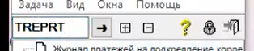
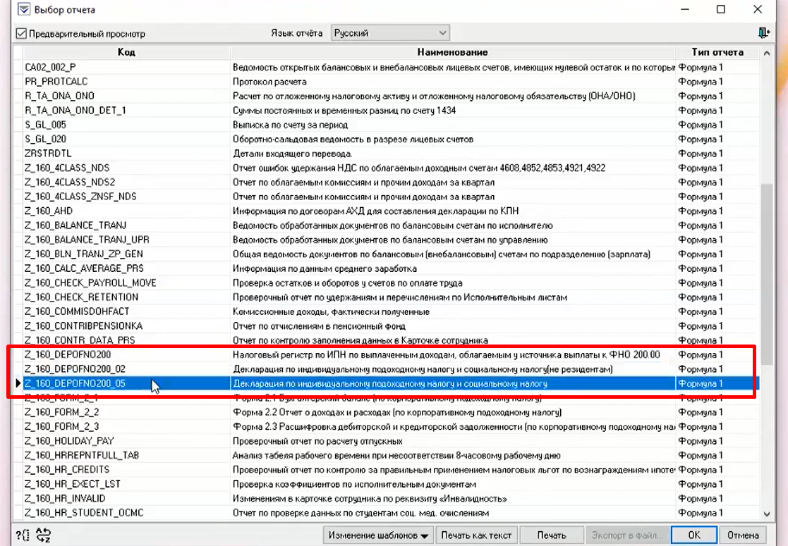
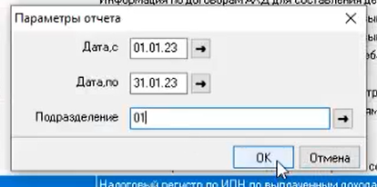
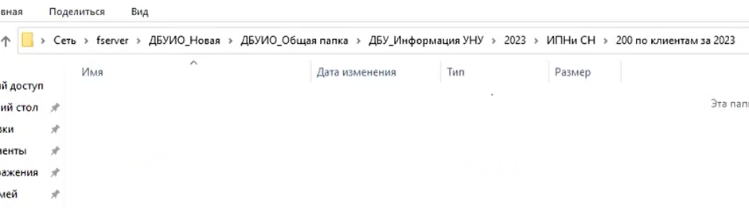

# Выгрузка налоговых регистров расчет по индивидуальному подоходному налогу и социальному налогу

## Оригинальная бизнес логика

| Шаг | Краткое описание                                                                                                                                                                                                        | Скриншот                             |
| --- | ----------------------------------------------------------------------------------------------------------------------------------------------------------------------------------------------------------------------- | ------------------------------------ |
| 1.  | Запускаем `Colvir`, переходим в задачу `TREPRT`                                                                                                                                                                         |  |
| 2.  | Выгружаем отчет в очередность<ul><li>`Z_160_DEPOFNO200_02`</li><li>`160_DEPOFNO200_05`</li><li>`Z_160_DEPOFNO200`</li></ul>По филиалам `01, 02, 03, 04, 05, 06, 07, 08, 09, 11, 12, 13, 14, 15, 17, 18, 19, 20, 21, 26` |  |
| 3.  | Задаем параметры даты «с\по» предыдущий календарный месяц и отдельное каждое подразделение. Присваиваем имя файлу `Код отчета__филиал`                                                                              |  |
| 4.  | Сохраняем в сетевой папке `ДБУ` _Примечание_:   Необходимо будет создать ветку папок: `Месяц->Код филиала`.                                                                                                     |  |
| 5.  | Выгрузка производится _5 числа каждого месяца за предыдущий_, после открытия операционного дня.                                                                                                                         |                                      |

## Краткое описание кода

Автоматизиция процесса выгрузки и конвертации отчетов из банковской системы Colvir. Скрипт выполняет следующие шаги:

1. Настраивает необходимые инструменты и конфигурации.
2. Получает информацию о отчетах, которые необходимо выгрузить. Эта информация включает типы отчетов, филиалы и диапазоны дат.
3. Робот открывает банковскую систему `Colvir` и выполняет вход в систему с использованием предоставленных учетных данных.
4. Выбирает соответствующий отчет, устанавливает необходимые параметры для отчета, начинает выгрузку и отправляет уведомление о прогрессе.
5. После выгрузки отчета робот сохраняет его в локальный файл на компьютере в формате `.xls`.
6. Повторяет этот процесс для каждого отчета, который необходимо выгрузить.
7. Когда все отчеты сгенерированы, робот закрывает сеансы Colvir и конвертирует сгенерированные отчеты из формата `.xls` в формат `.xlsb`.
8. Наконец, робот отправляет уведомление о завершении процесса.
